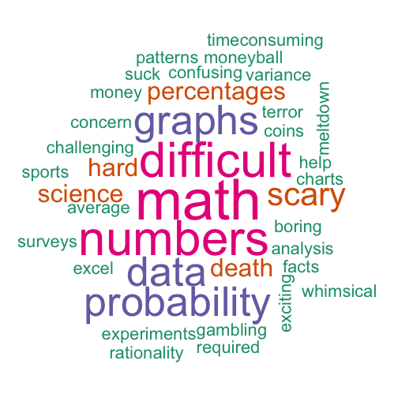

Chapter 02
========================================================
author: Displaying and Describing Categorical Data
date: January 14, 2015

Announcements
========================================================

- Add/drops
- Textbook
    - ***Intro Stats***, 4th Edition, Richard D. DeVeaux, Paul F. Velleman, & David E. Bock, Addison Wesley

What you thought of when you heard statistics
========================================================

 

Chapter 02
========================================================
type:section

## Chapter Outline

- Review - 5 W's of data
- Review - Categorical variables
- Distribution of one categorical variable
- Relationship between two categorical variables

Data
========================================================

- **Data**: Information that quantifies or describes people/places/things
- By itself, i.e. without context, data/numbers don't mean anything
- We use the 5 W's to bring context/meaning to the data

The 5 W's of data
========================================================

- Who
    - Cases, rows in data file
- What
    - Variables, columns in data file
- Where
    - Where did the data come from?
- When 
    - When were the data collected?
- Why
    - Why did we collect data?
    
Variables
========================================================

- The "What" are the variables
- They descibe the "Who"
- So far we have seen two types of variables
    - **Categorical**
    - **Quantitative**
- In this chapter we will focus entirely on understanding **categorical** variables
    - Also called **qualitative** variables or **attribute** variables


Categorical Variables vs. Quantitative
========================================================

**Categorical**
- Variables with labels as values (sometimes numbers)
- Categorical variables are an attribute of the "Who"
- Usually don't have units

Example:
- Gender
- Eye color

***

**Quantitative**
- Variables with numbers as values ALWAYS
- Quantify or measure an attribute of the "Who"
- Almost always have units

Example:
- Height (inches)
- Age (years)

Example
========================================================

<center>

sex    | age    | year   | height  | eye color
------ | ------ | ------ | ------- | ---------
female | 18     | first  | 68      | blue 
male   | 20     | third  | 70      | hazel
female | 18     | first  | 67      | green
male   | 22     | fourth | 62      | brown
...    | ...    | ...    | ...     | ...

</center>

- Rows are cases (students)
- Columns are variables (characteristics of students)

Categorical variables: ***sex***, ***year***, ***eye color***

Quantitative variables: ***age***, ***height***

Summarizing a single categorical variable
========================================================

- Number, proportion, or percentage of Who's in each category
- Summarize with
    - Frequency table
    - bar chart
    - pie chart
    
Frequency table
========================================================

- Lists the frequencies and number or proportion of Who's in each category
- Compare numbers and/or proportions

Example: Breakdown of education level of Mid-Atlantic respondents to a national survey


```
Source: local data frame [5 x 3]

        education frequency relative.freq
1       < HS Grad       268     0.1295938
2 Advanced Degree       426     0.2059961
3    College Grad       685     0.3312379
4         HS Grad       971     0.4695358
5    Some College       650     0.3143133
```

Bar Chart
========================================================

- Displays either number or percentage for each category
- Compare heights of bars
- Do not need to have all categories in display
- There are spaces between the bars
- Order of the bars does not matter

Example: Education
========================================================

 

Pie Chart 
========================================================

- Displays percentage of whole for each category
- Compare sizes of pie slices
- Must have all categories in display

Example: Education
========================================================

 

Describing the relationship between two categorical variables
========================================================

- Is there an association between the two categorical variables?
- Two variables
    - Variable of interest, i.e. **Response variable**
    - Other variable, i.e. **Explanatory variable**
    - The explanatory variable is being used to "explain" the differences in the response variable
    
Example
========================================================

Suppose we have the following variables:
- What political party are you a member of?
- Who did you vote for last election?

Which is the explanatory variable and which is the response variable?

- We are probably more interested in who people voted for
- Political party could explain who people vote for, so political party would be the explanatory variable and who people voted for would be the response variable

Two categorical variables
========================================================

### Questions we will ask ourselves:

- Is the distribution of the reponse variable different for different categories of the explanatory variable?
    - If so, then there is an **association** between the variables
- Is the distribution of the response variable approximately the same for the difference categories of the other variable?
    - There there is NOT an association between the two variables
    
Example
========================================================

- If the proportion of people that voted for Candidate A versus Candidate B is different for democrats and republicans, is there an association between the two variables?
    - YES
- If the proportion of people that voted for Candidate A versus Candidate B is the SAME for democrats and republicans, is there an association between the two variables?
    - NO
    
Describing the relationship between two categorical variables
========================================================

Data = two-way table, i.e. **Contingency Table**
- Rows are categories of the explanatory variable
- Columns are categories of the response variable
- Table entries: number of observations belonging to particular category of explanatory variable and particular category of response variable

Example: Education
========================================================

Data was collected from a national phone survey. Two of the questions asked were "what is your highest level of education" and "what is your marital status?"

We are interested in using education to explain marital status.


```
        education Divorced Married Separated
1       < HS Grad       16     174        14
2 Advanced Degree       22     341         1
3    College Grad       41     487         9
4         HS Grad       73     651        20
5    Some College       52     421        11
```


Response vs. Explanatory
========================================================


```
        education Divorced Married Separated
1       < HS Grad       16     174        14
2 Advanced Degree       22     341         1
3    College Grad       41     487         9
4         HS Grad       73     651        20
5    Some College       52     421        11
```

- What is the response?
    - Marital status (columns)
- What is the explanatory variable?
    - Education (rows)
    
Marginal Distributions
========================================================

- When we start with the joint distribution (contingency table) of two categorical variables **A** and **B**, we may just be interested in the distribution of variable **A**
- The **marginal** distribution of a variable **A** is just the distribution of **A** regardless of variable **B**
- The marginal distribution of **A** "ignores" variable **B**
- "Margins" of contingency table
- Same as looking at two variables seperately

Finding the marginal distribution with a contingency table
========================================================

To find the marginal distribution of **education**, sum across levels of **marital status**


```
        education div marr sep total
1       < HS Grad  16  174  14   190
2 Advanced Degree  22  341   1   363
3    College Grad  41  487   9   528
4         HS Grad  73  651  20   724
5    Some College  52  421  11   473
6           Total 204 2074  55  2278
```

Marginal distribution of education
========================================================


```
        Education Count Proportion
1       < HS Grad   190      0.083
2 Advanced Degree   363      0.159
3    College Grad   528      0.232
4         HS Grad   724      0.318
5    Some College   473      0.208
6           Total  2278           
```


Finding the marginal distribution of marital status
========================================================

This time we want to ignore the **education** variable, so we take the sum of **marital status** across all levels of **education**


```
        education div marr sep total
1       < HS Grad  16  174  14   190
2 Advanced Degree  22  341   1   363
3    College Grad  41  487   9   528
4         HS Grad  73  651  20   724
5    Some College  52  421  11   473
6           Total 204 2074  55  2278
```

Marginal distribution of marital status
========================================================


```
  Marital status Count Proportion
1       Divorced   204       0.09
2        Married  2074       0.91
3      Separated    55      0.024
4          Total  2278           
```


Conditional Distributions
========================================================

- We may be interested in how variable **A** is distributed for a certain level/category of variable **B**
- For this we want to examine the **CONDITIONAL** distribution of **A** given some level of **B**
- Looks at percentages for one variable contingent upon (conditioned on) a particular category for the other variable

Conditional Distributions
========================================================

What conditional distributions can tell you

- Compare conditional distributions to marginal distributions for the same variable
- Differences indicate a potential dependence (association) between the two variables

Example: education and marital status
========================================================


```
        education div marr sep total
1       < HS Grad  16  174  14   190
2 Advanced Degree  22  341   1   363
3    College Grad  41  487   9   528
4         HS Grad  73  651  20   724
5    Some College  52  421  11   473
6           Total 204 2074  55  2278
```

Distribution of **marital status** conditioned on **education** = "College grad"


```
     education   div  marr   sep total
3 College Grad    41   487     9   528
2  Proportion: 0.078 0.922 0.017      
```

Your turn
========================================================


```
        education div marr sep total
1       < HS Grad  16  174  14   190
2 Advanced Degree  22  341   1   363
3    College Grad  41  487   9   528
4         HS Grad  73  651  20   724
5    Some College  52  421  11   473
6           Total 204 2074  55  2278
```

1. What is the conditional distribution of marital status given education level is "Some college"
2. What is the conditional distribution of education given marital status is "divorced"
3. What is the overall proportion of divorced people?
4. What is the overall proportion of married college grads?

========================================================


```
        education div marr sep total
1       < HS Grad  16  174  14   190
2 Advanced Degree  22  341   1   363
3    College Grad  41  487   9   528
4         HS Grad  73  651  20   724
5    Some College  52  421  11   473
6           Total 204 2074  55  2278
```

**1.** What is the conditional distribution of marital status given education level is "Some college"?


```
     education  div marr   sep total
5 Some College   52  421    11   473
2  Proportion: 0.11 0.89 0.023      
```

========================================================


```
        education div marr sep total
1       < HS Grad  16  174  14   190
2 Advanced Degree  22  341   1   363
3    College Grad  41  487   9   528
4         HS Grad  73  651  20   724
5    Some College  52  421  11   473
6           Total 204 2074  55  2278
```

**2.** What is the conditional distribution of education given marital status is "divorced"?


```
        education divorced proportion
1       < HS Grad       16      0.078
2 Advanced Degree       22      0.108
3    College Grad       41      0.201
4         HS Grad       73      0.358
5    Some College       52      0.255
6           Total      204           
```

========================================================


```
        education div marr sep total
1       < HS Grad  16  174  14   190
2 Advanced Degree  22  341   1   363
3    College Grad  41  487   9   528
4         HS Grad  73  651  20   724
5    Some College  52  421  11   473
6           Total 204 2074  55  2278
```

**3.** What is the overall proportion of divorced people?


```r
204 / 2278 = 0.0896
```

========================================================


```
        education div marr sep total
1       < HS Grad  16  174  14   190
2 Advanced Degree  22  341   1   363
3    College Grad  41  487   9   528
4         HS Grad  73  651  20   724
5    Some College  52  421  11   473
6           Total 204 2074  55  2278
```

**4.** What proportion fall into the category of married and college grad?


```r
487 / 2278 = 0.213784
```


One more type of plot
========================================================

## Mosaic Plot

- Graphical summary of contitional distributions in contingency table
- Similar to segmented bar charts (in textbook)

Example
========================================================

 

Mosaic plot and associations
========================================================

- Association
    - The lines (segments) in the mosaic plot do not line up
    - Indicates conditional distributions are different
- No association
    - The lines (segments) in the mosaic plot line up to form a near perfect horizontal line
    - Indicates the conditional distributions are all the same
    
Example
========================================================

Are the conditional distributions of marital status the same across education levels?

 


