Chapter 03 Supplement
========================================================
author: Standard Deviation Examples
date: January 26, 2015

Deterimine which distribution has the greater standard deviation
========================================================

## Question 1

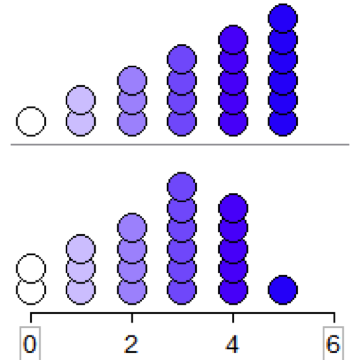 

Deterimine which distribution has the greater standard deviation
========================================================

## Question 2

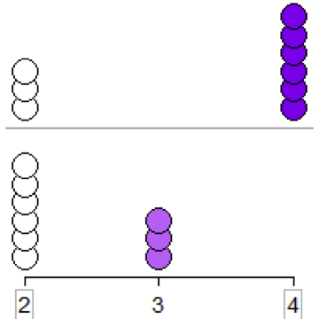 

Deterimine which distribution has the greater standard deviation
========================================================

## Question 3

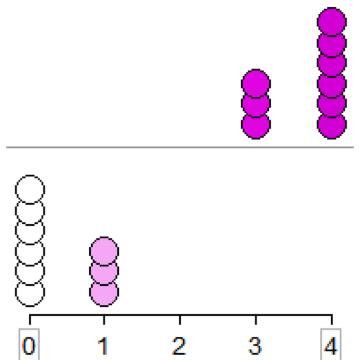 

Deterimine which distribution has the greater standard deviation
========================================================

## Question 4

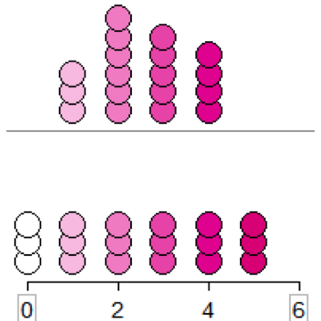 

Deterimine which distribution has the greater standard deviation
========================================================

## Question 5

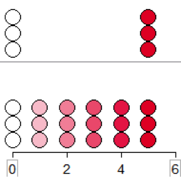 

Deterimine which distribution has the greater standard deviation
========================================================

## Question 6

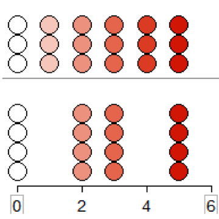 

Deterimine which distribution has the greater standard deviation
========================================================

## Question 7

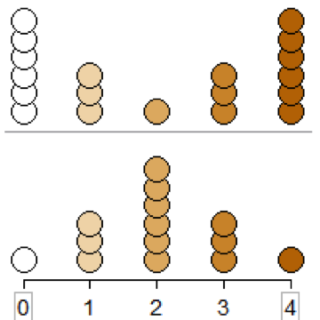 

Deterimine which distribution has the greater standard deviation
========================================================

## Question 8

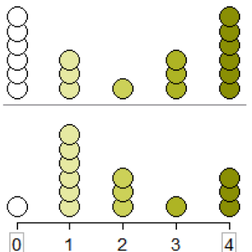 

Deterimine which distribution has the greater standard deviation
========================================================

## Question 9

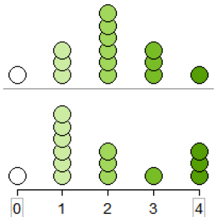 

Deterimine which distribution has the greater standard deviation
========================================================

## Question 10

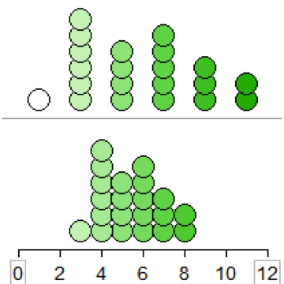 

Deterimine which distribution has the greater standard deviation
========================================================

## Question 11

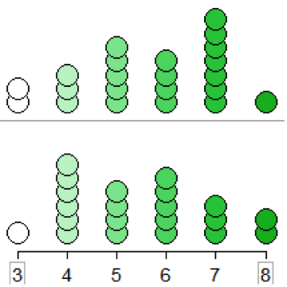 

Deterimine which distribution has the greater standard deviation
========================================================

## Question 12

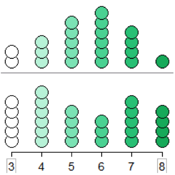 

Deterimine which distribution has the greater standard deviation
========================================================

## Question 13

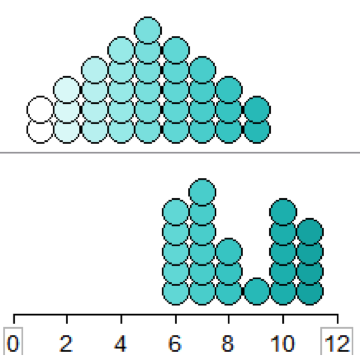 

Deterimine which distribution has the greater standard deviation
========================================================

## Question 14

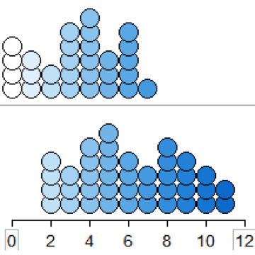 

Deterimine which distribution has the greater standard deviation
========================================================

## Question 15

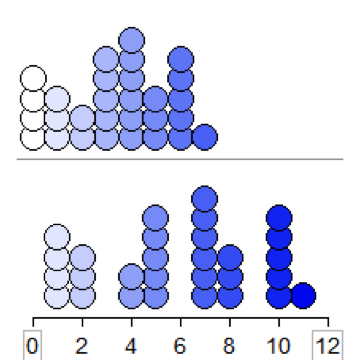 
