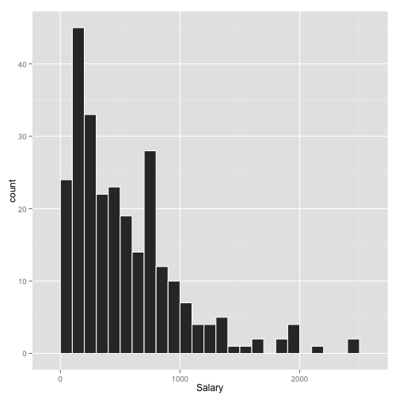
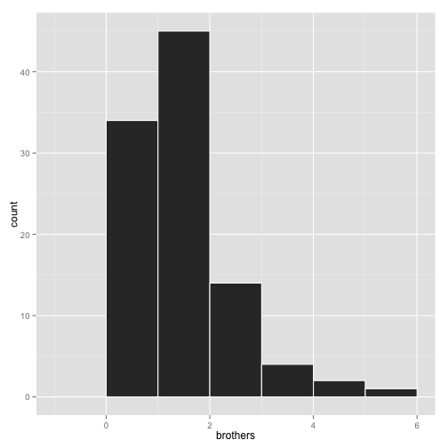
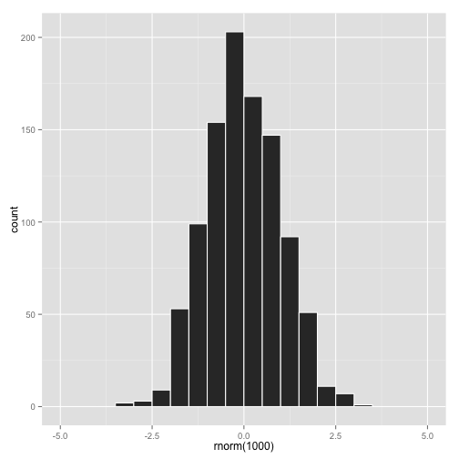
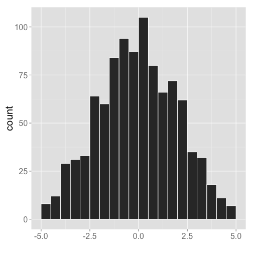
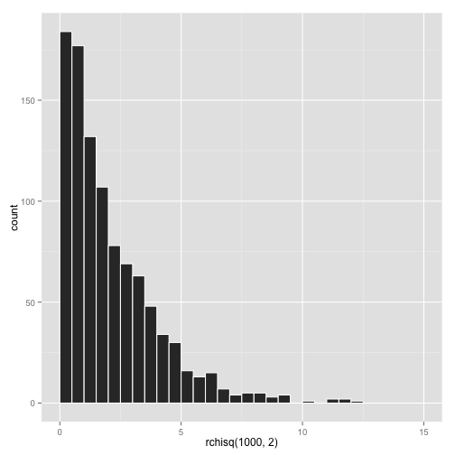
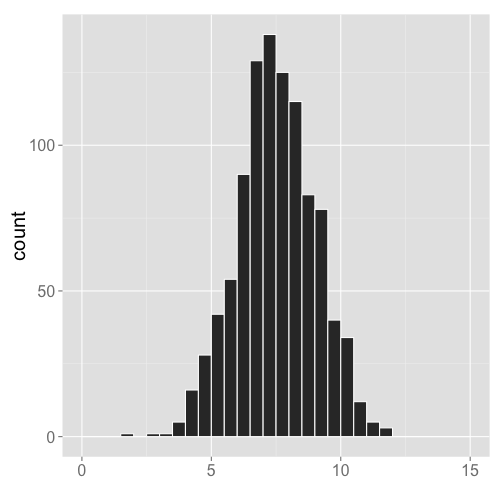
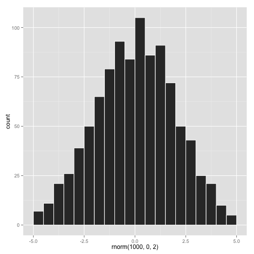
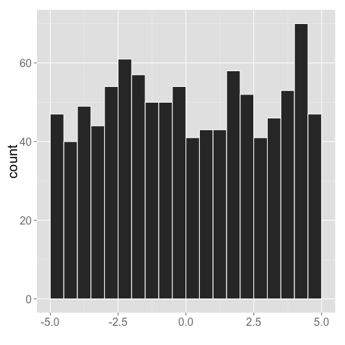
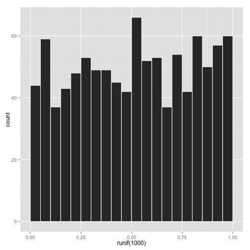
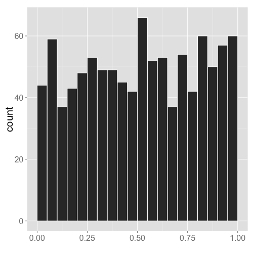

Chapter03
========================================================
author: Displaying and Summarizing Quantitative Data
date: Week 2

Announcements
========================================================

- Anymore add/drops?
- Lab
    - Bring laptops if you can
- JMP not working?

Chapter Outline
========================================================

- Review: Quantitative variables
- Describing a single quantitative variable
- Describing a single quantitative variable numerically
- We will deal with multiple quantitative variables in Chapter 4

Variable with numbers as values
========================================================

- Age
- Weight
- Height
- Number of siblings

Describing one quantitative variable
========================================================

- Distribution of variable
    - summary of different values observed for the variable
    - includes the "3 s's": shape, center, and spread
        - spread is also known as variation or variability
- Always start with making a picture
    - **histogram**
    - **stem-and-leaf display**
    
Example: baseball data
========================================================

- This data was collected from the MLB over the course of a season, the variable of interest is **Salary**


 

- X-axis is the variable (Salary in this case)
- Y-axis is the count of players that fall into each "bin" of salary

Bins of the histogram
========================================================

- On the previous slide the bins were 100 units wide 
- The choice of bin width is arbitrary, usually decided by the program that is creating the plot

 

- Here the binwidth was chosen to be 200

Histograms
========================================================

- Axis
    - X-axis is the quantitative variable
    - Y-axis is the count
- Bins will always have equal width
- The height of the bars represent the count of the "whos" belonging in each bin

Stem-and-leaf plot
========================================================

- Alternative to histogram
- Generally used for smaller data sets (Salary data is too big)
- Group data like histogram

Stem-and-leaf plot
========================================================

This data on the waiting time between eruptions of Old Faithful


```

  The decimal point is 1 digit(s) to the right of the |

  4 | 569
  5 | 01233344
  5 | 55789
  6 | 222344
  6 | 6
  7 | 012334
  7 | 67889
  8 | 0112233344
  8 | 5578
  9 | 03
```

Stem-and-leaf plot
========================================================

- **Leaf** 
    - Contains the last digit of the values
    - Arranged in increasing order way from stem
- **Stem**
    - Contains the rest of the values
    - Usually arranged in increasing order from top to bottom
    - JMP actually does the opposite, however
- **Key**
    - decodes value of stem and leaf
- Can think of stem-and-leaf plot as like a histogram turned on its side

Interpreting histograms and stem and leaf plots
========================================================

- Shape
    - Number of modes
    - Symmetry
    - Outliers
    
Looking at distributions
========================================================

- Shape
    - How many humps? (called **modes**)
        - None = uniform
        - One = unimodal
        - Two = bimodal
        - Three or more = multimodal
        
Looking at distributions
========================================================

- Shape
    - Is it symmetric?
        - Symmetric = roughly equal on both sides of middle
        
    - Skewed = more values on one side
        - Skewed right = more smaller values - trails off to the right
        - Skewed left = more larger values - trails off to the left
        
Looking at distributions
========================================================

- Shape 
    - Are there any outliers?
        - Far off from other points
        - Can impact statistical methods
        
Example: Baseball salary
========================================================

- How many modes?
    - One = unimodal
- Skewed?
    - Yes, skewed right
- Outliers?
    - Potentially a few in above 2000 (thousand $) 
    - Especially in the 2501 - 2600 bin
    
*** 

 

Example: Baseball salary
========================================================

- There is data on 322 players
- Would it be appropriate to make a stem-and-leaf display?

Example: Old Faithful
========================================================

- How many modes?
    - Two = bimodal
- Skewed?
    - No
    - Not quite symmetric though
- Outliers?
    - None

***

 

Example: Old Faithful
========================================================

We could make the same conclusions from the stem-and-leaf plots


```

  The decimal point is 1 digit(s) to the right of the |

  4 | 569
  5 | 01233344
  5 | 55789
  6 | 222344
  6 | 6
  7 | 012334
  7 | 67889
  8 | 0112233344
  8 | 5578
  9 | 03
```

Example: Subset of Stat 101 Data
========================================================

- Students were asked "How many brothers do you have?"
- A random sample of 100 Stat 101 students were examined

Data summary:


```
brothers
 0  1  2  3  4  5 
34 45 14  4  2  1 
```

- First row: how many brothers
- Second row: # of students with that many brothers

Example: Subset of Stat 101 data
========================================================


```
brothers
 0  1  2  3  4  5 
34 45 14  4  2  1 
```

 

***

Second row determines bar heights

Example: Subset of Stat 101 data
========================================================


```
brothers
 0  1  2  3  4  5 
34 45 14  4  2  1 
```

```

  The decimal point is at the |

  0 | 0000000000000000000000000000000000
  1 | 000000000000000000000000000000000000000000000
  2 | 00000000000000
  3 | 0000
  4 | 00
  5 | 0
```

Second row shows how many numbers in each row of stem-and-leaf plot

Looking at distributions
========================================================

- Center
    - Where is the typical value located?
        - **Median**
        - **Mean**
- Spread (variation)
    - How far apart are the values?
        - **Range**
        - **Interquartile range** (IQR)
        - **Standard deviation** (s)

Median
========================================================

- 50th percentile
    - 50% of the observations are below the median
    - 50% of the observations are above the median
- Median is the middle number
- Measures the center of the observations
- Different calcuation when 
    - n is odd
    - n is even
    
Median (n is odd)
========================================================

- Order the data from smallest to largest
- Median is the middle number on the list
- $(n+1) / 2$ numbers from the bottom
    - Ex: If $n = 11$, median is the $(n+1) / 2 = 6^{th}$ number from the bottom
    - Ex: If $n = 37$, median is the $(n+1) / 2 = 19^{th}$ number from the bottom
    
Example
========================================================

- 11 numbers


```
15 20 30 46 10 44 45 31 29 3 9
```

- Sort the numbers


```
3 9 10 15 20 29 30 31 44 45 46
```

- Median is the $(11 + 1) / 2 = 6^{th}$ number, which is **29**

Median (n is even)
========================================================

- Order the data from smallest to largest
- Median is the average of the two middle numbers
- (n+1) / 2 will be halfway between these two numbers
    - Ex. If $n = 10$, $(10 + 1) / 2 = 5.5$
        - Median is average of 5th and 6th numbers from bottom
        
Example
========================================================

- 10 numbers


```
15 20 30 46 10 44 45 31 29 3
```

- Sort the numbers


```
3 10 15 20 29 30 31 44 45 46
```

- Median is average of 5th and 6th numbers from bottom, which is **29.5**

Properties of the median
========================================================

- Which observations affect the median?
    - Only the middle number(s)
    
- These were our numbers before:


```
3 10 15 20 29 30 31 44 45 46
```

- Suppose we changed the last number to 1000


```
3 10 15 20 29 30 31 44 45 1000
```

- Median is still 29.5

Range
========================================================

- Measures variation (spread)
- Minimum - 0th percentile
- Maximum - 100th percentile
- Rangle = maximum - minimum
- Total variability of the observations

Example
========================================================


```
3 10 15 20 29 30 31 44 45 46
```

- Minimum = 3
- Maximum = 46
- Range = 46 - 3 = 43

Properties of the range
========================================================

- Which observations affect the range?
    - Only the minimum and the maximum
    

```
3 10 15 20 29 30 31 44 45 1000
```

- Range of data is 1000 - 3 = 997

Properties of the range
========================================================
incremental:true

- If the distribution of a quantitative variable shifts (i.e., a set value is added to all observations or a set value is subtracted from all observations) does the range change?
    - No. If the minimum and the maximum change by the same amount, the range stays the same
    

```
3 10 15 20 29 30 31 44 45 46
```

- Range is 43. Now shift data by 100


```
103 110 115 120 129 130 131 144 145 146
```

- Range is 146 - 103 = 43

IQR (Interquartile range)
========================================================

- Measures variation (spread)
- IQR = Q3 - Q1
    - Q1 = 25th percentile (first quartile)
    - Q3 = 75th percentile (third quartile)
- Measures the variability of the middle 50%

Finding Q1 and Q3
========================================================

- In general
    - Q1 is the median of the lower half of the ordered observations
    - Q3 is the median of the upper half of the ordered observtaions
Note: 
    - Actual calculations from textbook and JMP are slightly different
    
Example
========================================================


```
3 10 15 20 29 30 31 44 45 46
```

- Q1 = median of lower half = 15
- Q3 = median of upper half = 44
- IQR = 44 - 15 = 29

5-Number summary
========================================================

- Minimum
- Q1
- Median
- Q3
- Maximum

Example
========================================================


```
3 10 15 20 29 30 31 44 45 46
```

- Minimum = 3
- Q1 = 15
- Median = 29.5
- Q3 = 44
- Maximum = 46

Example
========================================================

On your own or with a neighbor compute the 5 number summary of this sample of waiting times in between eruptions at Old Faithful


```
54 62 62 63 64 71 79 80 81 83 85
```

- Minimum
- Q1
- Median
- Q3
- Maximum

Solution
========================================================


```
54 62 62 63 64 71 79 80 81 83 85
```

- Min = 54
- Q1 = 62.5
- Median = 71.0
- Q3 = 80.5
- Max = 85.0

Example: subset of Stat 101 students
========================================================

- Stat 101 students were asked "How many brothers do you have?"
- Took random sample of **100**
- What is the IQR?

***

 

Example: subset of Stat 101 students
========================================================

- IQR is the range of the middle 50%
- The middle of the bottom 50% is:
    - between the 25th and 26th numbers: 0
- The middle of the top 50% is:
    - between the 75th and 76th numbers: 1
- IQR = 1 - 0 = 1

*** 

 

Mean
========================================================

- Ordinary average
    - Add up all observations
    - Divide by the number of observations (n)
    
Formula
- $n$ observations
- $y_{1}, y_{2}, ..., y_{n}$ are the observations

$$ \bar{y} = \frac{y_{1},y_{2},...,y_{n}}{n} = \frac{\sum_{i=1}^{n}y_{i}}{n} $$

Example
========================================================


```
3 10 15 20 29 30 31 44 45 46
```

$$ \bar{y} = \frac{3 + 10 + 15 + ... + 44 + 45 + 46}{10} = \frac{273}{10} = 27.3 $$

Properties of the mean
========================================================
incremental:true

- Which observations affect the mean?
    - All of them!
    
- Example
    - Suppose we change the largest value to 1000

```
3 10 15 20 29 30 31 44 45 46
```

```
3 10 15 20 29 30 31 44 45 1000
```

Properties of the mean
========================================================


```
3 10 15 20 29 30 31 44 45 46
```

```
3 10 15 20 29 30 31 44 45 1000
```

Mean goes from 27.3 to 122.7

Standard Deviation
========================================================

- Denoted by the letter s
- Measures the variability (spread) from mean
    - Values closer to mean = smaller contribution to s
    - Values far away from mean = larger contribution to s
- S depends on how far way values are "on average" from the mean

Example
========================================================

- Consider the following three sets of numbers


A


```
20 20 20 20 20
```

B


```
10 15 20 25 30
```

C


```
5 10 15 20 50
```

Example
========================================================

- What is the same about all three sets of numbers?
    - The mean is 20
    
- What is different?
    - The shape and spread are different
    - Variability is different
    
Quantifying the variability
========================================================

Calculate the deviations from the mean

 A  | $x_{i} - \bar{x}$ |  B  | $y_{i} - \bar{y}$ |  C  | $z_{i} - \bar{z}$ 
--- | ----------------- | --- | ----------------- | --- | ----------------- 
 20 |                   |  10 |                   |  5  |                    
 20 |                   |  15 |                   |  10 |                    
 20 |                   |  20 |                   |  15 |                    
 20 |                   |  25 |                   |  20 |                    
 20 |                   |  30 |                   |  50 |                    

Quantifying the variability
========================================================

Calculate the deviations from the mean

 A  | $x_{i} - \bar{x}$ |  B  | $y_{i} - \bar{y}$ |  C  | $z_{i} - \bar{z}$ 
--- | ----------------- | --- | ----------------- | --- | ----------------- 
 20 |        0          |  10 |         -10       |  5  |       -15           
 20 |        0          |  15 |          -5       |  10 |       -10          
 20 |        0          |  20 |          0        |  15 |       -5          
 20 |        0          |  25 |         5         |  20 |       0           
 20 |        0          |  30 |         10        |  50 |       30            

Quantifying the variability
========================================================

- How can we convert this to 1 number to describe the variability?
- Aveage?
    - What is the average deviation for each sample?
- We want to know the average distance, so we don't want negative numbers
    - How do we get rid of negatives? Square the deviations
    
Quantifying the variability
========================================================

 A  | $x_{i} - \bar{x}$ | $(x_{i}-\bar{x})^{2}$ |  B  | $y_{i} - \bar{y}$ | $(y_{i}-\bar{y})^{2}$ |  C  | $z_{i} - \bar{z}$ | $(z_{i}-\bar{z})^{2}$ 
--- | ----------------- | --------------------- | --- | ----------------- | --------------------- | --- | ----------------- | ---------------------
 20 |        0          |                       |  10 |         -10       |                       |  5  |       -15         |  
 20 |        0          |                       |  15 |          -5       |                       |  10 |       -10         | 
 20 |        0          |                       |  20 |          0        |                       |  15 |       -5          |
 20 |        0          |                       |  25 |         5         |                       |  20 |       0           |
 20 |        0          |                       |  30 |         10        |                       |  50 |       30          |  


Quantifying the variability
========================================================

Calculate the squared deviations

 A  | $x_{i} - \bar{x}$ | $(x_{i}-\bar{x})^{2}$ |  B  | $y_{i} - \bar{y}$ | $(y_{i}-\bar{y})^{2}$ |  C  | $z_{i} - \bar{z}$ | $(z_{i}-\bar{z})^{2}$ 
--- | ----------------- | --------------------- | --- | ----------------- | --------------------- | --- | ----------------- | ---------------------
 20 |        0          |         0             |  10 |         -10       |           100         |  5  |       -15         |  225
 20 |        0          |         0             |  15 |          -5       |         25            |  10 |       -10         | 100
 20 |        0          |         0             |  20 |          0        |           0           |  15 |       -5          | 25
 20 |        0          |         0             |  25 |         5         |           25          |  20 |       0           | 0
 20 |        0          |         0             |  30 |         10        |           100         |  50 |       30          | 900


Quantifying the variability
========================================================

Average the squared deviations, but divide by $n-1$, not $n$

 A  | $x_{i} - \bar{x}$ | $(x_{i}-\bar{x})^{2}$ |  B  | $y_{i} - \bar{y}$ | $(y_{i}-\bar{y})^{2}$ |  C  | $z_{i} - \bar{z}$ | $(z_{i}-\bar{z})^{2}$ 
--- | ----------------- | --------------------- | --- | ----------------- | --------------------- | --- | ----------------- | ---------------------
 20 |        0          |         0             |  10 |         -10       |           100         |  5  |       -15         |  225
 20 |        0          |         0             |  15 |          -5       |         25            |  10 |       -10         | 100
 20 |        0          |         0             |  20 |          0        |           0           |  15 |       -5          | 25
 20 |        0          |         0             |  25 |         5         |           25          |  20 |       0           | 0
 20 |        0          |         0             |  30 |         10        |           100         |  50 |       30          | 900
    |     sum           |         0             |     |                   |           250         |     |                   | 1250
    |    $s^{2}$        | $\frac{0}{5-1}=0$     |     |                   | $\frac{250}{5-1}=62.5$|     |                   | $\frac{1250}{5-1}=312.5$        


Quantifying the variability
========================================================

- In the process we squared the deviations to get rid of the negative values
- How do we "un-square" a value?
    - Square root
    
Standard deviation

 Dataset |  $s^{2}$  | $s$ 
-------- | --------- | ----
 A       |   0       | 0
 B       | 62.5      | 7.91
 C       | 312.5     | 17.68
 
Properties of standard deviation
========================================================

- The standard deviation represent how far, on average, each value is from the mean
- Standard deviation can never be negative because we squared the deviations
- Formula

$$ 
\begin{align*}
s & = \sqrt{\frac{(y_{1}-\bar{y})^{2} + (y_{2}-\bar{y})^{2}+...+(y_{n}-\bar{y})^{2}}{n-1}} \\
& = \sqrt{\frac{\sum_{i=1}^{n}(y_{i}-\bar{y})^{2}}{n-1}}
\end{align*}
$$

Short Example
========================================================

- Data set (n = 5)


```
11 5 6 6 7
```

- Compute the standard deviation

Calculate the standard deviation
========================================================

 $x_{i}$ | $x_{i} - \bar{x}$ | $(x_{i}-\bar{x})^{2}$
-------- | ----------------- | ---------------------
 11      |                   |       
 5       |                   |
 6       |                   |
 6       |                   |
 7       |                   |  
         |    sum            |
         |   $s^{2}$         |
         |   $s$             |

Calculate the standard deviation
========================================================

 $x_{i}$ | $x_{i} - \bar{x}$ | $(x_{i}-\bar{x})^{2}$
-------- | ----------------- | ---------------------
 11      |      4            |       16
 5       |      -2           | 4
 6       |      -1           | 1
 6       |       -1          | 1
 7       |      0            |  0
         |    sum            | 22
         |   $s^{2}$         | $22/(5-1)=5.5$
         |   $s$             | $\sqrt{5.5}=2.35$
         
Standard deviation
========================================================

- Usually calculate using computer or calculator
    - Choose $n-1$ option on calculator
- If calculating by hand, it is recommended that you make a table

Example: baseball salary
========================================================

- The standard deviation for baseball salaries is 451.12 thousand dollars.
- How would you interpret this value?
- "The average distance of a player's salary to the mean of all players' salaries of 545.93 thousand dollars is 451.12 thousand dollars."
- "The deviation between the mean salary and the salary of each player is an average of 451.12 thousand dollars."

Properties of S
========================================================

- Which observations affect the value of s?
    - All are used in the computation, so all affect s
- What effect do outliers have on the standard deviation?
    - Outliers increase the value of the standard deviation
    
Properties of s
========================================================

- The standard deviation can never be negative
- Can the standard deviation be 0?
    - Yes, but only when all observations are equal
- So $s \geq 0$
- $s$ has the same units as the data
- Variance = $s^{2}$

Comparing standard deviations
========================================================

 

***

 

Comparing standard deviations
========================================================

 

***

 

Comparing standard deviations
========================================================

- Distributions that are more bell shaped typically have a smaller standard deviation than those that are skewed

Comparing standard deviations
========================================================

 

***

 

Comparing standard deviations
========================================================

- Distributions with bell shape tend to have smaller standard deviation than those that are uniform

Comparing standard deviations
========================================================

 

***

 

Comparing standard deviations
========================================================

- Distributions with large gaps tend to have larger standard deviations than those without gaps

Example
========================================================

- The mean age of my 695 Facebook friends is 25.3 years
- The standard deviation is 9.27 years
- Interpret the value of standard deviation

***

 

Interpreting standard deviation
========================================================

- Which interpretation(s) are correct?
    - The ages of my Facebook friends are 9.27 years away from the mean age of 25.3 years
    - The ages of my Facebook friends are 9.27 years away from the mean age of 25.3 years, on average
    - The average distance from the ages of my Facebook friends to the mean age of 25.3 years is 9.27
    - The average distance from the typical ages of my Facebook friends to the mean age of 25.3 years is 9.27 years
    - The typical deviation from the ages of my Facebook friends to the mean age of 25.3 years is 9.27
    
Interpreting standard deviation
========================================================

- Which interpretation(s) are correct?
    - ~~The ages of my Facebook friends are 9.27 years away from the mean age of 25.3 years~~
    - **The ages of my Facebook friends are 9.27 years away from the mean age of 25.3 years, on average**
    - **The average distance from the ages of my Facebook friends to the mean age of 25.3 years is 9.27**
    - ~~The average distance from the typical ages of my Facebook friends to the mean age of 25.3 years is 9.27 years~~
    - **The typical deviation from the ages of my Facebook friends to the mean age of 25.3 years is 9.27**
    
Comparison of the mean and median
========================================================

- Median = 50th percentile (middle number)

- Mean = fair share value (balancing point)

- Generally similar when distribution is symmetric with no outliers
- Generally different when either distribution is skewed or outliers are present

Influence of outliers on the mean and median
========================================================

- Consider the income in a small town of 6 people
    - $25,000, $27,000, $29,000, $35,000, $37,000, $38,000
- Mean income is $31,830
- Median income is $32,000

Influence of outliers on the mean and median
========================================================

- Bill Gates moves to town
    - $25,000, $27,000, $29,000, $35,000, $37,000, $38,000, $100,000,000
- The mean income is $14,313,000
- The median income is $35,000

Influence of outliers
========================================================

- Summaries not affected by outliers are called **robust** or **resistant**
- Center
    - Median: robust
    - Mean: not robust
- Variation
    - Range: not robust
    - IQR: robust
    - s = not robust
    
Influence of skewness on the mean and median
========================================================

- The observations in the tail influence the mean
- These observations do not (usually) influence the median
    - Skewed to the right (large values)
        - Mean > median
    - Skewed to the left (small values)
        - Mean < median

Mean vs. Median
========================================================

- Always question when mean are reported for skewed data
    - Income
    - Housing prices
    - Course grades
- Median is a better measure of the "typical" value for skewed data

Comparison of range, IQR, and standard deviation
========================================================

- Report range and IQR when you report median value
- report standard deviation when you report mean value

Which summaries are best?
========================================================

- Five number summary
    - Distribution is skewed 
    - Outliers are present
- Mean and standard deviation
    - Distribution is symmetric with no outliers
- Need to look at a picture of your data to determine which is best
    - Usually looking a histrogram will do
    
