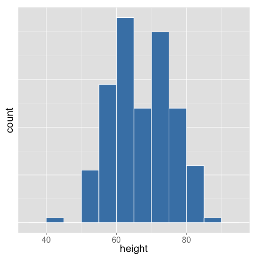
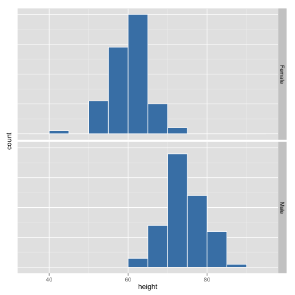
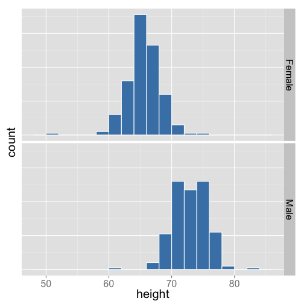
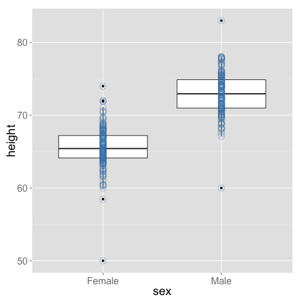
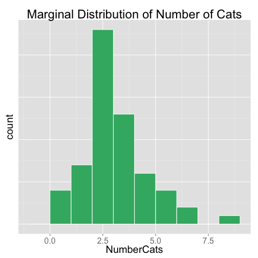
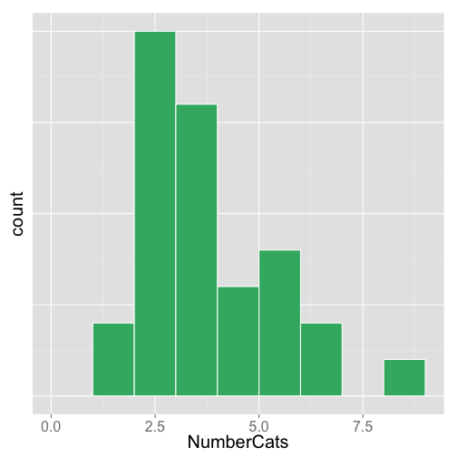
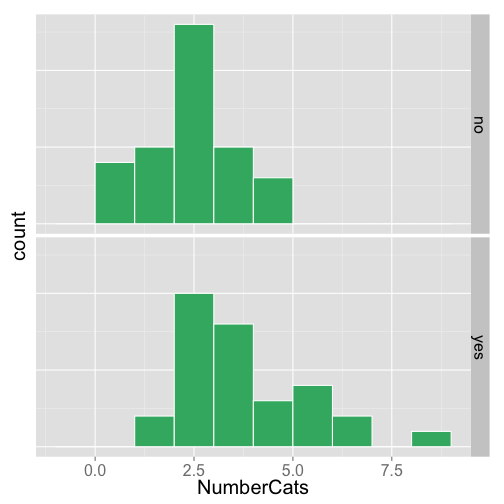
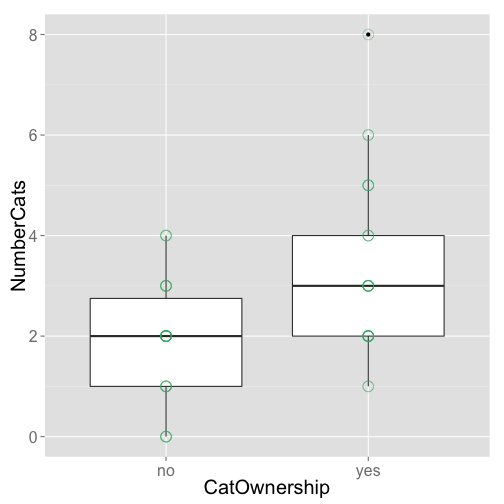

Chapter 04
========================================================
author: Understanding and Comparing Distributions
date: Week 3

Announcements
========================================================

- Quiz grades
    - Quiz 1 was attendance from first week
    - Quiz 2 was the actual quiz from last Friday
- I will return your written homeworks as soon I get those back from the graders
- Solutions are on BB
- Online homework solutions
    - Will be available on BB at 8:01 AM on Fridays (right after due date)


Chapter Outline
========================================================

- Comparing distribution of quantitative variable between groups
- Boxplots
    - Side-by-side boxplots
- Outliers
    - How do we define outliers?

Variables
========================================================

- **Categorical** 
    - Values = labels or categories
- **Quantitative**
    - Values = numbers
    
- Think qualities vs. quantities/measurements
    
Relationship between a categorical variable and quantitative variable
========================================================

- Divide the "who" into groups based on value of a categorical variable
- Compare distribution of quantitative variable between these groups
- Response variable = quantitative variable
- Explanatory variable = categorical variable

Example: Stat 101 student data
========================================================

 

Example: Stat 101 student data
========================================================

- Symmetric
- Bimodal
    - One around 65, the other around 72
- Outliers
    - Low - around 50 inches

***

 

Example: Stat 101 student data
========================================================

- Other variables collected
    - Gender
    - Year in college
    - Number of brothers and sisters
    - Exercise status
    - Etc.
- Are any of these variables associated with height?

Example: Stat 101 student data
========================================================

- Quantitative variable
    - Height
- Categorical variable
    - Gender (Male, Female)
    
Histograms of height for female and male students
========================================================
    
 

Height and Gender
========================================================

- Distribution of heights of Stat 101 students by gender
    - Roughly symmetric, bell shaped
    - Unimodal
    - Outliers 
        - low outlier for females, high for females
        - low for males, high for males
    
5-Number Summary
========================================================

       | Female | Male 
------ | ------ | -----
Min    | 50     | 60
Q1     | 64     | 71
Median | 65     | 73
Q3     | 67     | 75
Max    | 74     | 83

Boxplot
========================================================

- Graph of 5-number summary
    - Box between Q1 and Q3
    - Line in the box at median

Boxplot
========================================================

- Whiskers and outliers
    - Calculate Q1 - 1.5*IQR
    - If Min < Q1 - 1.5*IQR
        - Whisker out to Q1 - 1.5*IQR
        - Points less than Q1 - 1.5*IQR denoted by dots
    - If Min > Q1 - 1.5*IQR
        - Whisker out to Min
        
Boxplot
========================================================

- Whiskerks and outliers
    - Calculate Q3 + 1.5*IQR
    - If Max > Q3 + 1.5*IQR
        - Whisker out to Q3 + 1.5*IQR
        - Points greater than Q3+1.5*IQR denoted by dots
    - If Max < Q3 + 1.5*IQR
        - Whisker out to Max
        
Boxplots of height by sex
========================================================

 

Interpreting boxplots
========================================================

- Symmetry or skewness
    - Middle of distribution
        - Compare median - Q1 and Q3 - median
            - Roughly equal = symmetric
            - Median - Q1 < Q3 - median = skewed right
            - Median - Q1 > Q3 - median = skewed left
    - Ends of distribution
        - Compare Q1 - Min and Max - Q3
            - Roughly equal = symmetric and/or no outliers
            - Q1 - Min < Max - Q3 = skewed right or large outliers
            - Q1 - Min > Max - Q3 = skewed left or large outliers
            
Interpreting boxplots
========================================================

- Modes
    - Cannot be determined through boxplots
- Outliers
    - Potential outliers are marked with dots outside of whiskers
    - May or may not be potential outliers in histogram
    
Example
========================================================

- Female heights
    - Median- Q1 $\approx$ Q3 - median
        - Approximately symmetric
    - Q1 - Min > Max - Q3
        - Left skewed? No, just due to outlier
        
***

 

Example
========================================================

- Male heights
    - Q3 - Median $\approx$ Median - Q1
        - Approximately symmetric
    - Q1 - Min > Max - Q3
        - Outlier
        
***
        
 

What to do with outliers?
========================================================

- Check data entry
    - True value?
- If true value
    - Analyze both with the outlier and without
    
Choosing a graph for quantitative variables
========================================================

- Want to describe shape of distribution?
    - Histogram
- Want to compare distributions for groups?
    - Boxplots (especially if there are more than 2 groups)
    
Cats
========================================================

- What is the exact number of cats that you think is appropriate for one residence/family to have in the home at one period in time?
- Is this a quantitative or categorical variable?
- What are some categorical variables that could explain how many cats are appropriate for one residence?
    - Whether or not you own a cat
    
Cats
========================================================

- Suppose we want to examine the relationship between whether or not you own a cat and how many cats you think is acceptable to have in residence
- What's the first think we should do?
    - 5 w's
    
Cats: the 5 W's
========================================================

- Who
    - 60 adults
- What
    - Whether or not you own a cat and the number of acceptable cats
- Where 
    - Minnesota
- When
    - Spring 2012
- Why
    - To see if there is a relationship between whether or not you own a cat and the number of acceptable cats
- How
    - Online survey through Facebook
    
Cats
========================================================


     
 Number of Cats  | 0   | 1   | 2   | 3   | 4   | 5   |  6  | 7   | 8  
---------------- | --- | --- | --- | --- | --- | --- | --- | --- | --- 
 no              | 4   | 5   | 13  | 5   | 3   | 0   | 0   | 0   | 0  
 yes             | 0   | 2   | 10  | 8   | 3   | 4   | 2   | 0   | 1  


 

Cat owners
========================================================

 

Non-cat owners
========================================================

 

Cats
========================================================

 

Cats
========================================================

- Which measures of center and spread would be appropriate to examine?
- If data is symmetric, it would be more appropriate to use the mean and standard deviation
- If data is not symmetric, it would be more appropriate to use the median and IQR
- Cat owners were skewed right witha potential outlier and non-cat owners were bell-shaped
- We want to use the same measures for both, so lets go with median and IQR

5-number summary
========================================================

- Cat owners


```
   Min. 1st Qu.  Median 3rd Qu.    Max. 
      1       2       3       4       8 
```

- Non-cat owners


```
   Min. 1st Qu.  Median 3rd Qu.    Max. 
   0.00    1.00    2.00    2.75    4.00 
```

Cats
========================================================

- Now suppose we want to compare the groups
    - Which type of graph should be used to compare the groups (owners vs. non-owners)?
    
Cat Owners
========================================================

- Check for outliers
    - Recall: $Q1 = 2$ and $Q3 = 4$
- $IQR = 4 - 2 = 2$
- Check for low outliers
    - $Q1 - 1.5*IQR = 2 - 1.5*2 = -1$
    - No values less than -1, so there are no low outliers
- Check for high outliers
    - $Q3 + 1.5*IQR = 4 + 1.5*2 = 7$
    - There is a value in the dataset equal to 8, so 1 outlier
    - The next highest value in the dataset is 6, so that is how far out the whisker on the boxplot will go


Cats - comparing groups
========================================================

 

